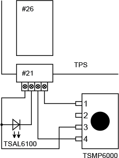

# Test application for the IR Code Processor Tibbit (#26)

You will need:

- An IR remote from your aircon, TV, or some other appliance
- Vishay TSAL6100 IR LED (or another IR LED)
- Vishay TSMP6000 IR receiver (or another suitable receiver)
- TPP2, TPP2(G2), TPP3, or TPP3(G2) board
- One Tibbit #26 (IR command processor)
- One Tibbit #21 (4 terminal blocks)
- Optionally, one Tibbit #9 or #10 (12V->5V regulator)
- Optionally, one Tibbit #18 (power jack)

*The last two Tibbits are necessary if you are going to power your rig from a 12V power adaptor. Alternatively, you can supply regulated +5V power directly to the TPP.*

Plug Tibbit #26 into the socket S1, Tibbit #21 into S2. Connect the IR LED and receiver to the terminal blocks of Tibbit #21 as shown in the diagram below.

  